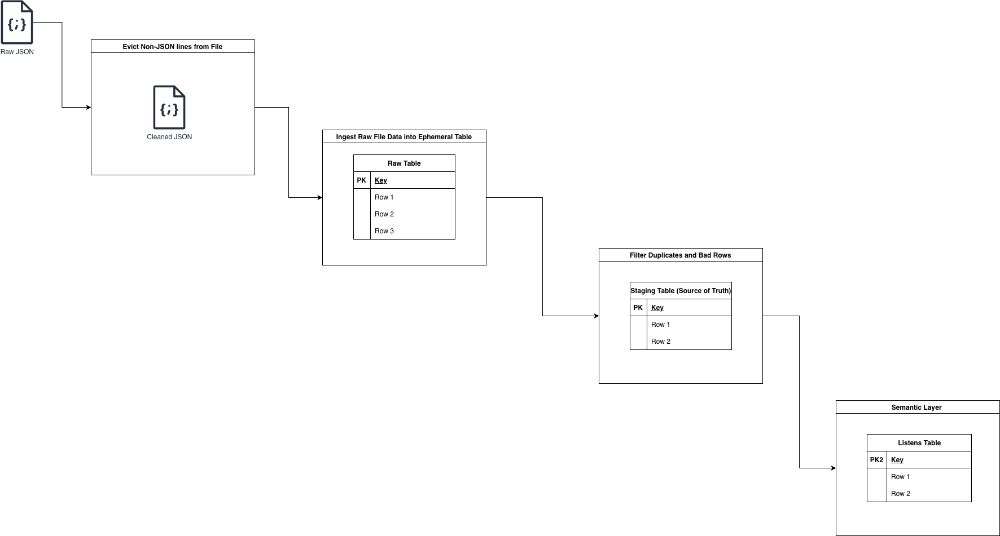

# Data Pipeline Installation Instructions



## Design Choices
For insights relating to structure and architecture, please read [Challenge.md](Challenge.md)

## Requirements
- [Docker Desktop](https://www.docker.com/products/docker-desktop/) (includes Docker Compose)
- Python 3.11 ([pyenv](https://github.com/pyenv/pyenv) recommended)

## Setup

**1. Clone the repo and enter the directory**
```bash
git clone <repo-url>
cd scalable-challenge-2026
```

**2. Add datafile and point to the data**
This pipeline requires a variable pointing to the listens jsonl dump to be in a .env file like the example [.env.example](.env.example) file.
For the convenience of the tester, a subset of the full data has been provided.

**3. Run with Docker Compose (recommended)**

The following command starts two docker containers — a Prefect orchestration server for visually viewing results and the data pipeline.

```bash
make build   # build the image (first time, or after changing dependencies)
make run     # start the stack using the cached image
```

The two services are:

| Service | Role |
|---|---|
| `prefect-server` | Prefect UI to view pipeline status, runs, and restarts [localhost:4200](http://localhost:4200) |
| `data-intake` | Runs the full pipeline (validate → dbt run → dbt test) |

The pipeline container waits for the Prefect server health check before starting. Once complete, the `listens` table is available inside the `db` Docker volume.

**4. Restart Service**
If you want to restart the service, simply run:
```bash
make clean
```
This removes temporary files and brings the Docker containers down.

**5. View the Prefect UI (optional)**

Open [localhost:4200](http://localhost:4200) once the server is healthy (~15 seconds). The UI shows each pipeline stage (Validate JSONL, dbt Transform & Test) with timing, logs, and retry state.


**6. Run locally (without Docker)**
Make sure you have an .env file locally - a sample .env has been included which includes the path to the file.
```bash
pyenv install 3.11.9
pyenv local 3.11.9
make install
make pipeline   # run the ingestion pipeline
make queries    # run the analysis queries
```

## All make commands

| Command | Description |
|---|---|
| `make build` | Build the Docker image |
| `make run` | Start full stack with Docker using the cached image (includes Prefect UI) |
| `make install` | Install Python dependencies locally |
| `make pipeline` | Run ingestion pipeline locally |
| `make queries` | Run analysis queries locally |
| `make dbt DATA_PATH=data/dataset-sample.jsonl` | Run dbt models and tests standalone |
| `make clean` | Remove `listens.db` and generated JSONL |
