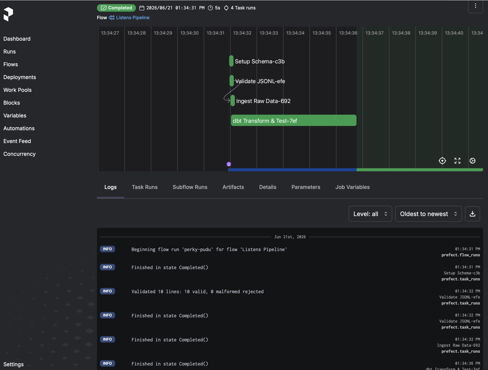

# Data Pipeline Installation Instructions

## Requirements

- [Docker Desktop](https://www.docker.com/products/docker-desktop/) (includes Docker Compose)
- Python 3.11 ([pyenv](https://github.com/pyenv/pyenv) recommended)

## Setup

**1. Clone the repo and enter the directory**
```bash
git clone <repo-url>
cd scalable-challenge-2026
```

**3. Run with Docker Compose (recommended)**

Docker Compose starts two services — a Prefect orchestration server for visually viewing results and the data pipeline.

```bash
docker compose up --build
```

To run in the background:
```bash
docker compose up --build -d
docker compose logs -f data-intake   # tail pipeline output
docker compose down                  # tear down when done
```

The two services are:

| Service | Role |
|---|---|
| `prefect-server` | Prefect UI and API at [localhost:4200](http://localhost:4200) |
| `data-intake` | Runs the full pipeline (validate → dbt run → dbt test) |

The pipeline container waits for the Prefect server health check before starting. Once complete, the `listens` table is available inside the `db` Docker volume.

**4. Run with Docker (via Make)**
```bash
make run   # equivalent to docker compose up --build
```

**5. View the Prefect UI (optional)**

Open [localhost:4200](http://localhost:4200) once the server is healthy (~15 seconds). The UI shows each pipeline stage (Validate JSONL, dbt Transform & Test) with timing, logs, and retry state.



**6. Run locally (without Docker)**
```bash
pyenv install 3.11.9
pyenv local 3.11.9
make install
make pipeline   # run the ingestion pipeline
make queries    # run the analysis queries
```

## All make commands

| Command | Description |
|---|---|
| `make run` | Start full stack with Docker (includes Prefect UI) |
| `make install` | Install Python dependencies locally |
| `make pipeline` | Run ingestion pipeline locally |
| `make queries` | Run analysis queries locally |
| `make dbt DATA_PATH=data/dataset.jsonl` | Run dbt models and tests standalone |
| `make clean` | Remove `listens.db` and generated JSONL |
